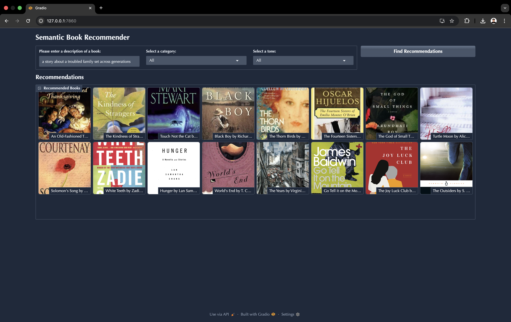

# Semantic Book Recommender with LLMs


An intelligent book discovery system that uses Large Language Models and vector search to provide personalized recommendations based on natural language descriptions, emotional tone, and semantic meaning.
## Executive Summary

The **Semantic Book Recommender** is an intelligent book discovery system that leverages Large Language Models (LLMs) and natural language processing to help users find books based on semantic meaning rather than keywords alone. Users can search for books using natural language descriptions (e.g., "a story about forgiveness"), filter by category (Fiction/Non-fiction), and sort by emotional tone (happy, suspenseful, sad, etc.). The application combines vector search, zero-shot classification, and sentiment analysis to deliver personalized book recommendations through an intuitive web interface.

## Problem & Context

### The Challenge
Traditional book recommendation systems rely on:
- **Keyword matching** - Limited ability to understand user intent
- **Metadata filtering** - Rigid category systems that miss nuance
- **Rating-based recommendations** - Doesn't capture emotional tone or thematic similarity

### The Solution
By leveraging LLMs and embeddings, we can:
1. **Understand semantic meaning** - Convert natural language queries into vector representations that match book descriptions semantically
2. **Classify books intelligently** - Use zero-shot classification to categorize books without extensive labeled training data
3. **Capture emotional tone** - Extract granular emotion scores to match users with books that align with their desired reading experience
4. **Create an accessible interface** - Deploy a web application that makes these powerful capabilities available to end users


## Tech Stack

### Core Libraries
- **LangChain** - Orchestrate LLM workflows and text processing
  - `langchain-community` - Document loaders
  - `langchain-openai` - OpenAI embeddings integration
  - `langchain-text-splitters` - Text chunking
  - `langchain-chroma` - Vector database integration

- **Chroma** - Vector database for semantic search
- **OpenAI API** - Embeddings and LLM capabilities
- **Transformers (Hugging Face)** - Pre-trained models for classification and sentiment analysis
  - `facebook/bart-large-mnli` - Zero-shot classification
  - `j-hartmann/emotion-english-distilroberta-base` - Emotion detection

### Data Processing
- **Pandas** - Data manipulation and analysis
- **NumPy** - Numerical computations
- **Matplotlib & Seaborn** - Data visualization

### Deployment
- **Gradio** - Build and deploy the web interface
- **Python 3.13** - Programming language

### Supporting Tools
- **Kagglehub** - Dataset downloads
- **python-dotenv** - Environment variable management
- **Jupyter & IPython** - Interactive development and exploration

See [requirements.txt](requirements.txt) for the complete dependency list.

## Repository Structure

```
book-recommender/
├── 1_data_exploration.ipynb          # Step 1: Data cleaning & exploration
├── 2_vector_search.ipynb             # Step 2: Semantic search setup
├── 3_text_classification.ipynb       # Step 3: Category classification
├── 4_sentiment_analysis.ipynb        # Step 4: Emotion extraction
├── 5_gradio_dashboard.py             # Final: Web application
│
├── Data Files (Generated)
├── books_cleaned.csv                 # Cleaned dataset after Step 1
├── books_with_categories.csv         # Dataset with categories after Step 3
├── books_with_emotions.csv           # Final dataset with emotions after Step 4
├── tagged_descriptions.txt           # Descriptions for vector database
│
├── Configuration
├── requirements.txt                  # Python dependencies
├── .env                              # Environment variables (OpenAI API key)
│
└── README.md                         # This file
```

---

## How the Project Was Created

### Step 1: Data Exploration & Cleaning ([1_data_exploration.ipynb](.1_data_exploration.ipynb))

**Objective:** Download the raw dataset, explore its structure, identify data quality issues, and prepare clean data for downstream processing.

**Process:**
1. **Download Data** - Uses Kagglehub to fetch the "7k-books-with-metadata" dataset
2. **Exploratory Data Analysis (EDA)**
   - Load dataset with ~7,000 books and examine shape/columns
   - Generate descriptive statistics with `.describe()`
   - Visualize missing values with a heatmap
3. **Data Quality Assessment**
   - Calculate correlation between key features (pages, age, ratings)
   - Identify books with sufficient descriptions (minimum 25 words)
   - Remove rows with missing critical fields (description, pages, rating, year)
4. **Data Transformation**
   - Create "title_and_subtitle" field for richer context
   - Generate "tagged_description" (ISBN + description) for vector database
5. **Output** - Saves cleaned dataset to `books_cleaned.csv`

**Key Insight:** Only books with descriptions of 25+ words are retained, ensuring sufficient semantic content for embeddings.

---

### Step 2: Semantic Vector Search ([2_vector_search.ipynb](.2_vector_search.ipynb))

**Objective:** Build a vector database that enables semantic similarity search, allowing users to find books conceptually similar to their query.

**Process:**
1. **Load Cleaned Data** - Read `books_cleaned.csv` and extract descriptions
2. **Create Tagged Descriptions** - Generate ISBN-prefixed descriptions and save to `tagged_descriptions.txt`
3. **Vector Database Setup**
   - Use `CharacterTextSplitter` to split descriptions by newline characters
   - Generate embeddings with `OpenAIEmbeddings()` (requires OpenAI API key in `.env`)
   - Store embeddings in Chroma vector database
4. **Semantic Search Function**
   - Query: "A book to teach children about nature"
   - Retrieve top 50 semantically similar descriptions
   - Return top 10 books by similarity score
5. **Output** - In-memory Chroma database (`db_books`) ready for semantic queries

**Key Capability:** Users can now search with natural language queries and get results based on semantic meaning, not keyword matching.

---

### Step 3: Zero-Shot Text Classification ([3_text_classification.ipynb](.3_text_classification.ipynb))

**Objective:** Automatically classify books as "Fiction" or "Non-fiction" using zero-shot classification, without requiring labeled training data.

**Process:**
1. **Load Data** - Read `books_cleaned.csv`
2. **Analyze Categories** - Examine original category field; many books lack classification
3. **Build Category Mapping**
   - Manually map 12 granular categories to 4 simplified ones:
     - "Fiction" (Fiction, Drama, Comics & Graphic Novels, Poetry)
     - "Children's Fiction" (Juvenile Fiction)
     - "Non-fiction" (Biography, History, Philosophy, Religion, Science, Literary Criticism)
     - "Children's Non-fiction" (Juvenile Non-fiction)
4. **Zero-Shot Classification**
   - Load `facebook/bart-large-mnli` model
   - For books with missing categories, classify using their description
   - Model predicts Fiction vs. Non-fiction with confidence scores
5. **Validation** - Test on 600 books with known categories; achieve >90% accuracy
6. **Fill Missing Data** - Classify ~400 books with unknown categories
7. **Output** - Saves updated dataset to `books_with_categories.csv`

**Key Capability:** Every book now has a reliable category, enabling filtering by Fiction/Non-fiction.

---

### Step 4: Sentiment & Emotion Analysis ([4_sentiment_analysis.ipynb](.4_sentiment_analysis.ipynb))

**Objective:** Extract emotional scores from book descriptions to enable users to sort books by tone (joyful, suspenseful, sad, etc.).

**Process:**
1. **Load Data** - Read `books_with_categories.csv`
2. **Load Emotion Classifier**
   - Use `j-hartmann/emotion-english-distilroberta-base` from Hugging Face
   - Detects 7 emotions: anger, disgust, fear, joy, sadness, surprise, neutral
3. **Emotion Extraction**
   - Split each book description into sentences (by period)
   - Classify emotions for each sentence
   - Aggregate by taking the maximum score per emotion across all sentences
   - Rationale: Captures the strongest emotions present in the text
4. **Batch Processing** - Process all ~5,000+ books and store emotion scores (anger, disgust, fear, joy, sadness, surprise, neutral)
5. **Output** - Saves enriched dataset to `books_with_emotions.csv` with 7 new emotion columns

**Key Capability:** Users can sort recommendations by emotional tone—find happy books, suspenseful page-turners, or emotional stories.

---

### Step 5: Web Application ([5_gradio_dashboard.py](.5_gradio_dashboard))

**Objective:** Provide an intuitive, interactive interface that combines all previous steps into a unified recommendation engine.

**Architecture:**
1. **Load Resources**
   - Read `books_with_emotions.csv` for book metadata and emotion scores
   - Initialize Chroma vector database with embeddings
   - Preload category and tone lists
2. **Recommendation Engine** - `retrieve_semantic_recommendations()`
   - Accept query string, category filter, and tone preference
   - Retrieve top 50 semantically similar books via vector search
   - Filter by category (if not "All")
   - Sort by emotion score (if tone selected)
   - Return top 16 results
3. **Result Formatting** - `recommend_books()`
   - Truncate descriptions to 30 words
   - Format author names (handle multiple authors with commas)
   - Create caption: "Title by Authors: Description..."
   - Return tuples of (thumbnail_url, caption) for gallery display
4. **UI Components** (Gradio Blocks)
   - **Input:** Query textbox, category dropdown, tone dropdown
   - **Control:** Submit button
   - **Output:** Gallery display (8 columns × 2 rows = 16 books)
   - **Theme:** Glass theme for modern aesthetics
5. **Launch** - `dashboard.launch()` starts local web server

**User Flow:**
```
User enters query → Vector search finds similar books →
Filter by category → Sort by tone → Display results as gallery
```

## Web Application
[<video width="100%" controls>
  <source src="z_demo.mov" type="video/quicktime">
  Your browser does not support the video tag. <a href="z_demo.mov">Download demo video</a>
</video>](https://github.com/user-attachments/assets/3cc5c6fb-7771-45be-abdb-e11ac7f9fc89)

### Features
✨ **Semantic Search** - Find books by natural language description  
📚 **Category Filtering** - Browse Fiction, Non-fiction, Children's categories  
😊 **Tone Sorting** - Sort by Happy, Surprising, Angry, Suspenseful, or Sad  
🖼️ **Visual Gallery** - Book covers with titles, authors, and descriptions  
⚡ **Real-time Processing** - Instant recommendations as you search  

### Running the Application

**Prerequisites:**
1. Install dependencies:
   ```bash
   pip install -r requirements.txt
   ```
2. Create `.env` file with your OpenAI API key:
   ```
   OPENAI_API_KEY=sk-your-key-here
   ```

**Launch:**
```bash
python 5_gradio_dashboard.py
```


## Skills Demonstrated

### Data Science & Engineering
- ✅ **Data Exploration & Cleaning** - Handled missing values, outlier detection, feature engineering
- ✅ **Statistical Analysis** - Correlation analysis, descriptive statistics, data visualization
- ✅ **Data Pipeline Development** - Multi-stage ETL process from raw data to production-ready dataset

### Natural Language Processing (NLP)
- ✅ **Text Embeddings** - Leveraged OpenAI embeddings for semantic understanding
- ✅ **Vector Databases** - Designed and queried Chroma for semantic similarity search
- ✅ **Zero-Shot Classification** - Applied pre-trained models without labeled training data
- ✅ **Sentiment & Emotion Analysis** - Extracted nuanced emotional signals from text
- ✅ **Text Processing** - Implemented tokenization, chunking, and aggregation strategies

### Large Language Models (LLMs)
- ✅ **LLM Integration** - Used OpenAI embeddings API for semantic representations
- ✅ **Prompt Engineering** - Designed effective zero-shot classification prompts
- ✅ **Pre-trained Model Utilization** - Leveraged BART and DistilRoBERTa for tasks without retraining

### Machine Learning
- ✅ **Transfer Learning** - Applied pre-trained models to new tasks
- ✅ **Validation & Testing** - Evaluated classification accuracy across datasets
- ✅ **Hyperparameter Selection** - Tuned parameters like chunk size, top-k retrieval, and emotion aggregation

### Software Engineering
- ✅ **Modular Code Design** - Separated concerns (retrieval, filtering, formatting, UI)
- ✅ **Configuration Management** - Used environment variables for API key security
- ✅ **Interactive Development** - Jupyter notebooks for exploratory analysis and documentation
- ✅ **Web Application Development** - Built user-facing interface with Gradio
- ✅ **Reproducibility** - Documented process and provided requirements.txt for dependency management

### Tools & Frameworks
- ✅ **LangChain** - Orchestrated multi-step NLP workflows
- ✅ **Hugging Face Transformers** - Accessed and deployed state-of-the-art models
- ✅ **Gradio** - Rapidly prototyped web interface without frontend expertise
- ✅ **Jupyter Notebooks** - Documented exploratory analysis and communication
- ✅ **Git & Version Control** - Managed project iterations

## Getting Started

### Installation
```bash
# Clone or download the repository
cd book-recommender

# Create virtual environment (optional but recommended)
python -m venv venv
source venv/bin/activate  # On Windows: venv\Scripts\activate

# Install dependencies
pip install -r requirements.txt
```

### Configuration
Create a `.env` file in the project root:
```
OPENAI_API_KEY=your_openai_api_key_here
```

### Running the Notebooks (Optional - Data Already Provided)
If you want to regenerate the datasets from scratch:
```bash
jupyter notebook 1_data_exploration.ipynb
jupyter notebook 2_vector_search.ipynb
jupyter notebook 3_text_classification.ipynb
jupyter notebook 4_sentiment_analysis.ipynb
```

### Running the Web Application
```bash
python 5_gradio_dashboard.py
```

Then open the link in your browser.

## Acknowledgments

- **Dataset:** [7k Books with Metadata](https://www.kaggle.com/datasets/dylanjcastillo/7k-books-with-metadata) from Kaggle
- **Pre-trained Models:**
  - BART (facebook/bart-large-mnli) for zero-shot classification
  - DistilRoBERTa (j-hartmann/emotion-english-distilroberta-base) for emotion detection
- **Frameworks:** LangChain, Hugging Face Transformers, Gradio, Chroma

